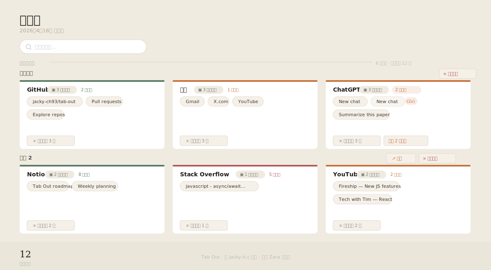

# Tab Out

**把你的标签页管起来。**

Tab Out 是一个 Chrome 扩展，将扩展页面变成你所有标签页的控制台。标签页按域名分组，主页（Gmail、X、LinkedIn 等）单独归为一组，关闭时有愉快的音效和彩屑动画。

无服务器。无账号。无外部 API 调用。纯 Chrome 扩展。

[English README](README_EN.md)

---



---

## 为什么需要 Tab Out

浏览器的设计哲学是「鼓励你打开新标签页」——搜索结果一键新开、链接右键另开、Cmd+T 唾手可得。但它从来不会提醒你关掉那些已经不需要的标签页。

于是积累效应开始发生：

- **浏览器越来越卡** — 每个标签页都在占用内存和 CPU，几十个挂在后台，风扇转，电池掉，整机变慢
- **找不到想去的那个标签页** — 几十个小图标挤在一排，只能靠肉眼扫描，或者重新搜一遍
- **同一个页面不知不觉开了好几次** — 打开 ChatGPT，发现已经有三个了，但不知道哪个是刚才用的那个
- **「稍后再看」永远不会来** — 那些「等会儿要看」的标签页一直挂着，既不看也不关，越堆越多
- **多个窗口各自为政** — 工作用一个窗口，刷社交媒体用另一个，没有整体视图
- **背景焦虑** — 明知道有一堆东西开着没处理，注意力总被悄悄占用

Tab Out 反过来做：**让关掉标签页变得轻松、清晰、甚至有点爽**。打开它就能看到所有标签页的全貌，一眼识别哪些久未访问、哪些重复、哪些可以直接清掉——然后带着音效和彩屑关掉它们。

---

## 功能特性

**基础功能**
- **一览所有标签页** — 整洁的网格布局，按域名分组
- **主页分组** — 将 Gmail、X、YouTube、LinkedIn、GitHub 主页归为一组
- **关闭有仪式感** — 关闭时附带音效和彩屑动画
- **重复检测** — 标记同一页面开了多次，一键清理（跨窗口也能检测）
- **点击跳转** — 点任意标签页标题即可跳转，不会新开标签页
- **稍后阅读** — 关闭前保存到待办清单，支持归档
- **localhost 分组** — 显示端口号，让你区分不同的本地项目
- **展开更多** — 每组显示前 8 个，多余的可点击展开
- **100% 本地** — 数据不离开你的设备
- **纯扩展** — 无服务器、无 Node.js、无 npm、加载即用

**新增功能**
- **模糊搜索** — 顶部搜索栏，支持按标题 / URL / 域名实时过滤标签页
- **多窗口分组** — 不同窗口的标签页分开显示，带窗口标题
- **窗口快捷操作** — 一键切换到其他窗口，或关闭整个窗口的所有标签页
- **活跃度指示** — 每组标签页顶部显示彩色状态条：绿色（活跃）/ 橙色（冷却）/ 红色（久未使用），并显示最后访问时间
- **多语言支持** — 自动跟随浏览器语言，支持中文（简体/繁体）、日语、韩语、英语
- **深色模式** — 自动跟随系统颜色主题，无需手动切换
- **悬停预览** — 鼠标悬停 tab 时弹出浮动卡片，显示完整标题、最后访问时间和同域名 tab 数量
- **实时自动刷新** — 在其他窗口打开或关闭标签页时，页面自动更新，无需手动刷新；右上角提供手动刷新按钮
- **个人配置** — 支持 `config.local.js`，可自定义主页规则和自定义分组（文件已 gitignore）
- **快捷方式** — 顶部重要网址图标栏，左键点击直接跳转并自动获取图标，右键点击编辑，支持添加、删除、修改、拖拽排序；数据通过 Chrome Sync 跨设备同步（适合作为浏览器主页使用）

---

## 安装方式

选择以下任一方式：

**方式一：用编程 Agent 安装（推荐）**

把这个仓库地址发给你的编程 Agent（Claude Code、Codex 等），说"帮我安装这个"：

```
https://github.com/jacky-ch93/tab-out
```

Agent 会引导你完成。

**方式二：下载 Release 安装**

1. 前往 [Releases 页面](https://github.com/jacky-ch93/tab-out/releases)，下载最新版本的 `Source code (zip)`
2. 解压缩
3. 打开 Chrome，进入 `chrome://extensions`
4. 开启右上角的**开发者模式**
5. 点击**加载未打包的扩展程序**，选择解压后的 `extension/` 文件夹
6. 点击扩展图标，Tab Out 页面将会打开

**方式三：克隆仓库安装**

1. 克隆仓库

```bash
git clone https://github.com/jacky-ch93/tab-out.git
```

2. 打开 Chrome，进入 `chrome://extensions`
3. 开启右上角的**开发者模式**
4. 点击**加载未打包的扩展程序**，选择仓库中的 `extension/` 文件夹
5. 点击扩展图标，Tab Out 页面将会打开

---

## 工作原理

```
点击扩展图标
  -> Tab Out 显示所有标签页，按域名分组
  -> 主页（Gmail、X 等）单独置顶
  -> 点击任意标签页标题跳转过去
  -> 关闭不需要的分组（音效 + 彩屑）
  -> 关闭前可保存到稍后阅读
```

所有逻辑都在扩展内部运行。无外部服务器，无 API 调用，数据不发送到任何地方。已保存的标签页存储在 `chrome.storage.local`。

---

## 技术栈

| 模块 | 实现方式 |
|------|----------|
| 扩展 | Chrome Manifest V3 |
| 存储 | chrome.storage.local |
| 音效 | Web Audio API（合成音，无音频文件） |
| 动画 | CSS 过渡 + JS 彩屑粒子 |

---

## License

MIT

---

由 [Zara](https://x.com/zarazhangrui) 原创 · 由 [jacky-h.c](https://github.com/jacky-ch93) 持续开发
