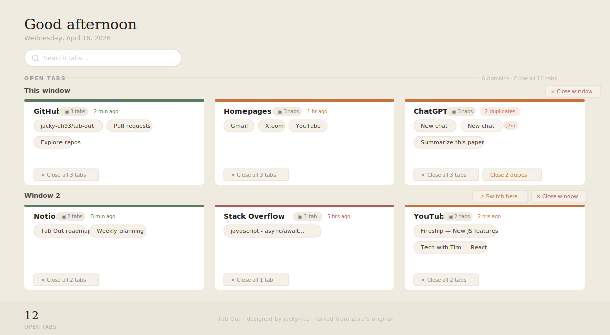

# Tab Out

**Keep tabs on your tabs.**

Tab Out is a Chrome extension that turns the extension page into a dashboard of everything you have open. Tabs are grouped by domain, with homepages (Gmail, X, LinkedIn, etc.) pulled into their own group. Close tabs with a satisfying swoosh + confetti.

No server. No account. No external API calls. Just a Chrome extension.

[中文 README](README.md)

---



---

## Why Tab Out

Browsers are designed to make opening tabs effortless — search results open in a new tab, links right-click to "open in new tab", Cmd+T is always right there. But nothing ever nudges you to close the ones you no longer need.

So the pile quietly grows:

- **Your browser gets slower** — every tab consumes memory and CPU; dozens running in the background means fans spinning, battery draining, everything sluggish
- **You can't find the tab you actually want** — thirty tiny favicons in a row, so you either squint and scan or just search again
- **You've opened the same page multiple times** — you open ChatGPT and find three already there, but have no idea which one you were using
- **"Read it later" never comes** — those "I'll get to it" tabs just sit there, never read, never closed, piling up endlessly
- **Multiple windows with no overview** — work in one window, social media in another, no single view of everything
- **Background anxiety** — you know there's a pile of unfinished stuff open; it quietly drains your attention

Tab Out flips the script: **makes closing tabs easy, clear, and even a little satisfying**. Open it and see everything at a glance — spot which tabs haven't been touched in days, which are duplicates, which you can just clear out — then close them with a swoosh and confetti.

---

## Features

**Core**
- **See all your tabs at a glance** — clean grid layout, grouped by domain
- **Homepages group** — pulls Gmail inbox, X home, YouTube, LinkedIn, GitHub homepages into one card
- **Close tabs with style** — swoosh sound + confetti burst on close
- **Duplicate detection** — flags when the same page is open twice, one-click cleanup (cross-window aware)
- **Click any tab to jump to it** — no new tab opened, works across windows
- **Save for later** — bookmark tabs to a checklist before closing, with archive support
- **Localhost grouping** — shows port numbers so you can tell your local projects apart
- **Expandable groups** — shows first 8 tabs, rest are behind a clickable "+N more"
- **100% local** — your data never leaves your machine
- **Pure extension** — no server, no Node.js, no npm, just load and go

**New in this fork**
- **Fuzzy search** — search bar at the top, filters tabs by title / URL / domain name in real time
- **Multi-window grouping** — tabs split by window with section headers
- **Window actions** — switch to another window or close all tabs in a window in one click
- **Staleness indicators** — colored bar per group: green (active) / amber (cooling) / red (abandoned), with last-accessed time
- **i18n support** — UI follows browser language automatically; supports Simplified Chinese, Traditional Chinese, Japanese, Korean, English
- **Dark mode** — automatically follows the system color scheme, no manual toggle needed
- **Hover preview** — hovering a tab shows a floating card with the full title, last accessed time, and tab count for that domain
- **Live auto-refresh** — dashboard updates automatically when tabs open or close in other windows; manual refresh button in the top-right corner
- **Personal config** — `config.local.js` (gitignored) lets you define custom landing page rules and tab grouping
- **Shortcuts** — top bar with important website icons; left-click to open (auto-fetches favicon), right-click to edit (add, delete, modify, drag to reorder). Data syncs across devices via Chrome Sync. Perfect for use as your browser homepage

---

## Install

Choose one of the following:

**Option 1: With a coding agent (recommended)**

Send your coding agent (Claude Code, Codex, etc.) this repo and say **"install this"**:

```
https://github.com/jacky-ch93/tab-out
```

The agent will walk you through it.

**Option 2: Download a Release**

1. Go to the [Releases page](https://github.com/jacky-ch93/tab-out/releases) and download the latest `Source code (zip)`
2. Unzip it
3. Open Chrome and go to `chrome://extensions`
4. Enable **Developer mode** (top-right toggle)
5. Click **Load unpacked** and select the `extension/` folder inside the unzipped directory
6. Click the extension icon — Tab Out will open

**Option 3: Clone the repo**

1. Clone the repo

```bash
git clone https://github.com/jacky-ch93/tab-out.git
```

2. Open Chrome and go to `chrome://extensions`
3. Enable **Developer mode** (top-right toggle)
4. Click **Load unpacked** and select the `extension/` folder inside the cloned repo
5. Click the extension icon — Tab Out will open

---

## How it works

```
Click the extension icon
  -> Tab Out shows your open tabs grouped by domain
  -> Homepages (Gmail, X, etc.) get their own group at the top
  -> Click any tab title to jump to it
  -> Close groups you're done with (swoosh + confetti)
  -> Save tabs for later before closing them
```

Everything runs inside the Chrome extension. No external server, no API calls, no data sent anywhere. Saved tabs are stored in `chrome.storage.local`.

---

## Tech stack

| What | How |
|------|-----|
| Extension | Chrome Manifest V3 |
| Storage | chrome.storage.local |
| Sound | Web Audio API (synthesized, no audio files) |
| Animations | CSS transitions + JS confetti particles |

---

## License

MIT

---

Originally built by [Zara](https://x.com/zarazhangrui) · Extended by [jacky-h.c](https://github.com/jacky-ch93)
