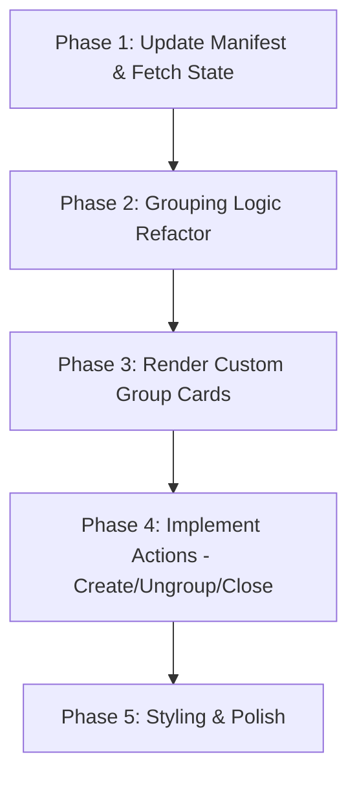

# Implementation Plan: Chrome Tab Group Integration for Tab Out

This document outlines the proposed design and implementation steps for integrating Chrome's native **Tab Groups** feature into the **Tab Out** extension.

---

## 1. Feasibility & Value Analysis

### Is this a good idea?
**Yes, this is an excellent idea.**
Currently, Tab Out groups tabs solely by domain on its custom dashboard. While this is helpful for cleanups, it completely ignores the user's manual organization. 
Integrating Chrome's native Tab Groups creates a unified experience:
1. **Respects User Organization**: If a user has already grouped tabs (e.g., "Work", "Research", "Leisure") in their browser, the dashboard will display these distinct contexts as their own cards rather than mixing them by domain.
2. **Unified Dashboard**: Tab Out becomes a powerful controller for native Tab Groups—allowing users to close, rename, or color-code groups from the dashboard.
3. **Automated Grouping**: Users can group a chaotic pile of domain-matched tabs into a native Chrome Tab Group with a single click.

---

## 2. Technical Overview & API Access

To interact with Chrome's native Tab Groups, we must utilize the `chrome.tabGroups` and `chrome.tabs` APIs.

### A. Permission Changes (`manifest.json`)
We need to add the `"tabGroups"` permission to allow querying and modifying group titles, colors, and collapsed states.
```json
"permissions": ["tabs", "activeTab", "storage", "tabGroups"]
```
> [!NOTE]
> Adding a new permission to an existing published extension triggers a browser warning requiring user re-approval. For a personal fork, this is not an issue.

### B. Core API Methods Needed
* **Query groups**: `chrome.tabGroups.query(object queryInfo)` gets all active groups.
* **Get group details**: `chrome.tabGroups.get(int groupId)` gets metadata for a specific group (title, color, collapsed state).
* **Create/Add tabs to group**: `chrome.tabs.group({ tabIds: [...], groupId: existingGroupId })` groups tabs.
* **Ungroup tabs**: `chrome.tabs.ungroup(int[] tabIds)` removes tabs from groups.
* **Modify group details**: `chrome.tabGroups.update(int groupId, { title, color, collapsed })` edits group properties.

---

## 3. Proposed UI/UX Architecture

Instead of having only domain-based cards, the dashboard will now support **two types of cards**:

```
+---------------------------------------+   +---------------------------------------+
|  [Chrome Group] Work (Blue)     [3]  |   |  github.com (Domain fallback)   [5]   |
+---------------------------------------+   +---------------------------------------+
|  - Status bar matches group color     |   |  - Neutral status bar                 |
|  - Displays tabs in this native group |   |  - Displays ungrouped github tabs    |
|  - Actions:                           |   |  - Actions:                           |
|    [Close Group] [Ungroup]            |   |    [Close tabs] [Create Chrome Group] |
+---------------------------------------+   +---------------------------------------+
```

### Color Mapping
Chrome's native tab group colors (`grey`, `blue`, `red`, `yellow`, `green`, `pink`, `purple`, `cyan`, `orange`) can be mapped directly to Tab Out's existing CSS styling system:
```css
/* Color mappings for native Chrome groups */
.group-color-grey   { --group-accent: #5a6b7a; }
.group-color-blue   { --group-accent: #3b82f6; }
.group-color-red    { --group-accent: #ef4444; }
.group-color-yellow { --group-accent: #f59e0b; }
.group-color-green  { --group-accent: #10b981; }
.group-color-pink   { --group-accent: #ec4899; }
.group-color-purple { --group-accent: #8b5cf6; }
.group-color-cyan   { --group-accent: #06b6d4; }
.group-color-orange { --group-accent: #f97316; }
```

---

## 4. Implementation Steps



### Phase 1: Update Manifest & Fetch State
1. Update `manifest.json` to include `"tabGroups"` in the `permissions` array.
2. In `app.js`, modify `fetchOpenTabs()` to query both tabs and active groups:
   ```javascript
   const [tabs, groups] = await Promise.all([
     chrome.tabs.query({}),
     chrome.tabGroups.query({})
   ]);
   ```
3. Map tabs to capture their `groupId`. Store the groups array in a global variable or map for quick lookup.

### Phase 2: Refactor Grouping Logic
In `renderStaticDashboard()`, adapt the grouping logic:
1. First, partition tabs into two buckets:
   * **Grouped tabs**: `tab.groupId !== -1` (or `chrome.tabGroups.TAB_GROUP_ID_NONE`)
   * **Ungrouped tabs**: `tab.groupId === -1`
2. Group the **grouped tabs** by their `groupId`. For each native group, lookup its title and color from the `groups` list.
3. Group the **ungrouped tabs** using the existing domain-based logic (including landing pages and custom groups).

### Phase 3: Render Native Group Cards
1. Modify `renderDomainCard()` (or create a new `renderTabGroupCard()`) to support native groups:
   * Display the native group title (or fallback to `"Group " + groupId` if untitled).
   * Apply a CSS class matching the group's color (e.g., `group-color-blue`) to style the card header or borders dynamically.
   * Add a badge indicating it is a "Chrome Tab Group".

### Phase 4: Implement Actions
1. **Close Native Group**: Clicking "Close Group" calls `chrome.tabs.remove(tabIds)` for all tabs in that group.
2. **Ungroup**: Add an action button on native group cards to ungroup all tabs: `chrome.tabs.ungroup(tabIds)`.
3. **Create Native Group from Domain Card**:
   * For domain cards (ungrouped tabs), add a button: **"Turn into Group"**.
   * When clicked, call `chrome.tabs.group({ tabIds })` to group them in Chrome, then update the group's title to the friendly domain name using `chrome.tabGroups.update()`.

### Phase 5: Styling & Polish
1. Add smooth CSS transitions when ungrouped domain cards transition into native group cards.
2. Update the background badge updater in `background.js` if necessary (badge should still count all real web tabs, but we can verify it doesn't break).

---

## 5. Potential Challenges & Mitigations

1. **Multi-Window Groups**:
   * *Problem*: Native Tab Groups in Chrome cannot span across multiple windows.
   * *Mitigation*: If a user has a "Work" group in Window 1 and another "Work" group in Window 2, Chrome assigns them different `groupId`s. We should display them as two separate cards (e.g., `Work (Window 1)` and `Work (Window 2)`) to reflect Chrome's actual state.
2. **Tab Group Management Permissions**:
   * *Problem*: System-level pages (`chrome://*`) cannot be added to tab groups.
   * *Mitigation*: Tab Out already filters out browser internal pages in `getRealTabs()`, so this is automatically avoided.
